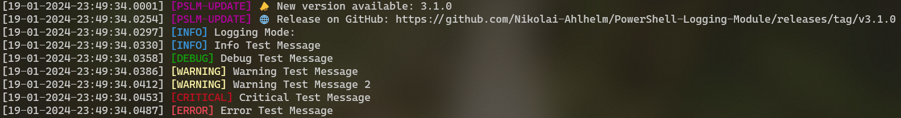
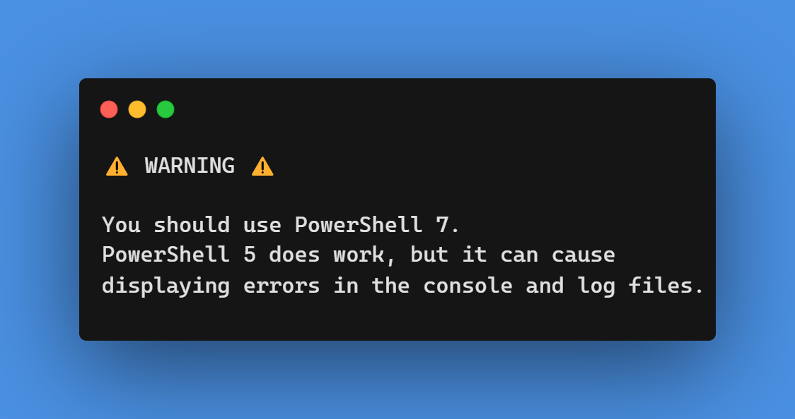

# PowerShell Logging Module - Version 3.3.0
 Logging Module made for Powershell

 
 

## Logentry types (case insensitive) 
 - INFO 	  (info, inf, i)
 - WARNING  (warning, warn, w)
 - CRITICAL (critical, crit, c)
 - ERROR	  (error, err, e)
 - DEBUG    (debug, dbg, d)
 - Custom   (Just enter any string you wish)

 

## Logmode / Logtype (case insensitive)

| **Type**       | **Short** | **INFO** | **WARNING** | **CRITICAL** | **ERROR** | **DEBUG** |
|----------------|-----------|----------|-------------|--------------|-----------|-----------|
| **DEFAULT**    | DEF       |     X    |      X      |       X      |     X     |           |
| **DEBUG**      | DBG       |     X    |      X      |       X      |     X     |     X     |
| **PRODUCTIVE** | PROD      |     X    |             |       X      |     X     |           |
| **ERROR**      | ERR       |          |             |              |     X     |           |
| **CRITICAL**   | CRIT      |          |             |       X      |           |           |

 

---

 

## Contructor
### **``New-Object -TypeName PSLM -ArgumentList (string:LOGNAME,string:LOGPATH,string:LOGMODE,bool:PRINTTOCONSOLE,string:TIMESTAMPFORMAT)``**

 

### LOGNAME:  
**"%yyyy%-%MM%-%dd%-log.txt"**  
Use:   ``%dd%`` : Day,  
``%MM%`` : months,  
``%yyyy%`` : year,  
``%hh%`` : hour,  
``%m%`` : minutes,  
``%ss%`` : seconds  
They will be replaced with the acording value e.g. %yyyy% = 2023

 

### LOGPATH: 
**``".\logs\"``** or **``"C:\the\path\"``**  

 

### LOGMODE:  
**``"Default"``**  
Choose one of the logmodes listed above.  

   

### PRINTTOCONSOLE:  
**``\$TRUE``** or **``\$FALSE``**  
Enable or disable console output. 

  
  
### TIMESTAMPFORMAT: 
**``"default"``**
Set timestamp format, use predefined formats:  
**``"default"``** : dd-MM-yyyy-HH:mm:ss.ffff  
**``"time"``** :  
**``"day"``** :  
Or define your own, for examples check the official Microsoft Docs [here](https://learn.microsoft.com/en-us/powershell/module/microsoft.powershell.utility/get-date?view=powershell-7.3#examples).

 

---

## Methods

 

### Entry(TYPE,MESSAGE)  
Creates a single log entry with timestamp.
 
#### Interfaces (Used to give your code a cleaner look)
``Info(MESSAGE)``
``Debug(MESSAGE)``
``Warning(MESSAGE)``
``Critical(MESSAGE)``
``Error(MESSAGE)``

 

### SetLogFilePath(PATH)  
Set/change the path to the log file.

 

### SetConsoleOut(BOOL)  
Activate/Deactivate console output of log mesages.

 

### SetTimeFormat(STRING)  
Set/change the timeformat to a customized format.

 

### LogCleanup(int:RETENTIONDAYS)  
Clean logs that are older than the retention date specified in the constructor.  
Warning: This function deletes **all** files inside the logfoler, that are older than the retentiondays! This also effects non log files, because the tool has no feature to detect if the file is a log file or something else! 

 

_________________

 

# Changelog

## Version 3.3.0
- Feature: 5 new interfaces for the entry function (Info, Warn, Error, Crit, Debug)
- Feature: New interface examples to example.ps1
- Feature: Warning image in readme.md about use of PowerShell 5
- Change: $Log to $PSLM in the example.ps1
- Change: readme file updated to 3.3.0

## Version 3.2.0
- Feature: UpdateCheck function, that checks GitHub for a new version of PSLM
- Feature: Added example image for readme.md
- Change: Various code optimisations
- Change: Removed the `"Unknown"` company from the module manifest
- Change: Custom log types color is now magenta
- Change: Reworked the README file
- Fix: Fixed bugs from first commit

## Version 3.1.0
- Feature: Info bracket colored in darkcyan
- Feature: Add backslash to end of log path, if not already set by user
- Change: Example file import .psd1 instead od .psm1
- Fix: Timestamp change from minutes from %mm% to %m%
- Fix: Unable to change timestamp format in constructor

## Version 3.0.1
 - INFO color changed to dark cyan
 - LogCleanup now logs how many files got deleted

## Version 3.0
 - Changed name from **Logger** to **PSLM**
 - New LogCleanup Method
 - New Constructor argument `LOGNAME`
 - New Constructor argument `TIMESTAMPFORMAT`
 - Changed from `ps1` to `psm1` file
 - Fixed 12-hour format is now 24-hour format
 - Log output is colored now
   - yellow -> warning
   - red -> error
   - darkred -> critical
   - grey/default -> info

## Version 2.3.1 Bugfix
 - Fixed false return if logmode is none or unvalid

## Version 2.3
 - **Logmodes/logtypes** can now be set, to only log certain log entries
 - New Entrytype: `DEBUG`, only displayed when Logmode is set to `DEBUG`
 - Constructor takes a new argument `LOGTYPE`
 - Updated `example.ps1` and `README.md`
 - Deleted old versions folder

## Version 2.2
 - First char of type parameter is now accepted (case insensitive)
 - Log Message is now shown in console
 - Performance improved (removed repetative tasks for each type)
 - Updated `example.ps1` and `README.md`
 - New function `SetConsoleOut`
 - New function `SetTimeFormat`
 

## Version 2.1
 - Function `[void] LogEntry` -> `[void] Entry`
 - Simple Instructions in file header
 - Changed timeformat, now with milliseconds
 - Renamend `test.ps1` -> `example.ps1` and updated file
